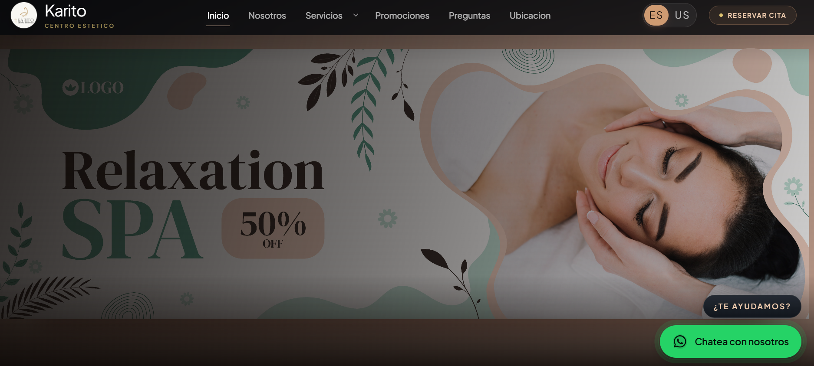

# Karito Centro Estetico

Sitio web de Karito Centro Estetico construido con React y Vite. El proyecto presenta servicios de medicina estetica facial y corporal, promociones, informacion institucional y contenido comercial editable desde archivos de datos e imagenes centralizadas.

## Resumen

- Aplicacion web tipo SPA con rutas internas personalizadas.
- Contenido principal centralizado en `src/data`.
- Imagenes resueltas desde archivos locales o desde Cloudinary.
- Soporte de idioma `es` y `en`.
- PWA configurada con `vite-plugin-pwa`.

## Stack

- React 19
- Vite 8
- Tailwind CSS 4
- React Compiler
- Vite PWA
- Cloudinary para entrega de imagenes

## Como esta organizado el proyecto

La aplicacion no usa `react-router`. Las rutas se resuelven manualmente en [src/app/App.jsx](/home/puma/projects/Web_KaritoCentroEstetico/src/app/App.jsx:1), donde se decide que pagina renderizar segun `window.location.pathname`.

### Estructura principal

```text
src/
  app/
    App.jsx                  # Punto central de rutas, meta tags y render principal
    providers/               # Providers globales, incluido el idioma
  assets/
    images/                  # Imagenes locales y resolver hacia Cloudinary
  components/
    home/                    # Tarjetas y piezas visuales de inicio
    layout/                  # Header, footer, layout, WhatsApp flotante
    promotions/              # Modal y piezas de promociones
    services/                # Tarjetas relacionadas y componentes de servicios
    ui/                      # Componentes reutilizables de presentacion
  data/
    site.js                  # Contenido general del sitio en espanol
    site.en.js               # Contenido general del sitio en ingles
    serviceCatalog.js        # Catalogo de servicios y rutas genericas
    genericServiceContent.js # Contenido auxiliar de servicios genericos
    uiText.js                # Textos compartidos de interfaz
  pages/
    home/                    # Pagina de inicio
    about/                   # Pagina nosotros
    services/                # Paginas de servicios
  sections/
    home/                    # Bloques de la home
    about/                   # Bloques de nosotros
    services/                # Bloques reutilizables de servicios
  styles/
    globals.css              # Estilos globales
  utils/
    navigation.js            # Helpers de navegacion interna
    mutableData.js           # Soporte para sincronizar contenido mutable por idioma
```

## Flujo de la aplicacion

### 1. Entrada principal

- [src/main.jsx](/home/puma/projects/Web_KaritoCentroEstetico/src/main.jsx:1) monta React, registra el service worker y carga los estilos globales.
- [src/app/providers/AppProviders.jsx](/home/puma/projects/Web_KaritoCentroEstetico/src/app/providers/AppProviders.jsx:1) envuelve toda la app con providers globales.

### 2. Idioma

- [src/app/providers/LocaleProvider.jsx](/home/puma/projects/Web_KaritoCentroEstetico/src/app/providers/LocaleProvider.jsx:1) guarda el idioma activo en `localStorage`.
- Al cambiar el idioma, se sincronizan `site`, `serviceCatalog`, `genericServiceContent` y `uiText`.

### 3. Contenido

- La mayor parte del texto del sitio vive en [src/data/site.js](/home/puma/projects/Web_KaritoCentroEstetico/src/data/site.js:1) y su variante [src/data/site.en.js](/home/puma/projects/Web_KaritoCentroEstetico/src/data/site.en.js:1).
- El catalogo de servicios y las paginas genericas viven en [src/data/serviceCatalog.js](/home/puma/projects/Web_KaritoCentroEstetico/src/data/serviceCatalog.js:1).
- Esto permite cambiar textos, tarjetas, promociones o servicios sin reestructurar componentes.

### 4. Layout y secciones

- `pages/` define las pantallas.
- `sections/` agrupa bloques grandes de cada pagina.
- `components/` contiene piezas reutilizables.

## Rutas actuales

- `/` inicio
- `/nosotros`
- `/promociones`
- `/limpiezas-faciales`
- `/tratamientos-faciales`
- `/tratamientos-corporales`
- `/limpieza-facial-profunda`
- `/botox`
- `/reductor`
- Varias rutas adicionales generadas desde `serviceCatalog.js`, como `/dermaplaning`, `/hidrafacial`, `/mesoterapia`, `/novuma`, entre otras

## Imagenes y Cloudinary

El proyecto toma todas las imagenes desde [src/assets/images/index.js](/home/puma/projects/Web_KaritoCentroEstetico/src/assets/images/index.js:1).

### Como funciona

- Si `VITE_CLOUDINARY_CLOUD_NAME` esta definido en `.env`, la app arma la URL desde Cloudinary.
- Si esa variable no existe, usa la imagen local importada en el proyecto.
- La ruta remota se construye usando:
  - `VITE_CLOUDINARY_BASE_FOLDER`
  - la carpeta local dentro de `src/assets/images`
  - el nombre del archivo sin extension

### Regla importante para reemplazar imagenes

Si quieres entrar a Cloudinary y cambiar una imagen sin tocar codigo, debes conservar el mismo `public_id`.

Ejemplo:

```text
src/assets/images/hero/hero_1.jpg
=> public_id: karito-centro-estetico/hero/hero_1
```

Entonces:

- Si reemplazas la imagen existente dentro de Cloudinary manteniendo ese `public_id`, la web mostrara la nueva imagen.
- Si subes otra imagen con nombre distinto, la web no cambiara automaticamente.
- Lo importante no es solo la carpeta visual: lo importante es la ruta completa y el nombre base del archivo.
- La extension no forma parte del `public_id` que usa el frontend.

### En practica, que debes hacer

1. Entra a la carpeta correcta dentro de Cloudinary.
2. Busca el recurso que ya existe.
3. Reemplazalo manteniendo el mismo `public_id`.

Notas utiles:

- Si usas la opcion de reemplazar el asset existente desde Cloudinary, el `public_id` se conserva.
- Si subes un archivo nuevo manualmente, debes asegurarte de que quede con la misma ruta y el mismo nombre base.
- Si el cambio no aparece al instante, normalmente basta con recargar fuerte el navegador porque puede haber cache temporal.

Si prefieres subir desde el proyecto en vez de hacerlo manualmente en el panel:

```bash
npm run cloudinary:upload-images
```

Y si solo quieres revisar que rutas se van a generar:

```bash
node scripts/upload-cloudinary-images.mjs --dry-run
```

Referencia adicional: [src/assets/images/README.md](/home/puma/projects/Web_KaritoCentroEstetico/src/assets/images/README.md:1)

## Variables de entorno

Usa [.env.example](/home/puma/projects/Web_KaritoCentroEstetico/.env.example:1) como base.

```env
VITE_CLOUDINARY_CLOUD_NAME=
VITE_CLOUDINARY_BASE_FOLDER=karito-centro-estetico
VITE_CLOUDINARY_DELIVERY_TYPE=upload
VITE_CLOUDINARY_TRANSFORMATION=f_auto,q_auto
VITE_CLOUDINARY_VERSION=
VITE_CLOUDINARY_API_KEY=
VITE_CLOUDINARY_UPLOAD_PRESET=
CLOUDINARY_API_SECRET=
```

### Variables clave

- `VITE_CLOUDINARY_CLOUD_NAME`: activa la entrega de imagenes desde Cloudinary.
- `VITE_CLOUDINARY_BASE_FOLDER`: carpeta base remota usada para construir el `public_id`.
- `VITE_CLOUDINARY_TRANSFORMATION`: transformaciones de entrega.
- `VITE_CLOUDINARY_VERSION`: opcional, util si quieres fijar una version especifica del asset.
- `VITE_CLOUDINARY_API_KEY` y `CLOUDINARY_API_SECRET`: necesarias para la subida automatizada desde el script local.
- `VITE_CLOUDINARY_UPLOAD_PRESET`: hoy no es necesario para el flujo automatizado actual del proyecto.

## Scripts disponibles

```bash
npm install
npm run dev
npm run build
npm run preview
npm run lint
npm run cloudinary:upload-images
```

## Desarrollo local

1. Instala dependencias:

```bash
npm install
```

2. Crea tu archivo `.env` a partir de `.env.example`.

3. Inicia el entorno local:

```bash
npm run dev
```

4. Genera build de produccion:

```bash
npm run build
```

## Puntos importantes de mantenimiento

- Si agregas o renombras rutas, revisa [src/app/App.jsx](/home/puma/projects/Web_KaritoCentroEstetico/src/app/App.jsx:1).
- Si agregas servicios nuevos, actualiza [src/data/serviceCatalog.js](/home/puma/projects/Web_KaritoCentroEstetico/src/data/serviceCatalog.js:1).
- Si cambias textos generales, revisa [src/data/site.js](/home/puma/projects/Web_KaritoCentroEstetico/src/data/site.js:1) y [src/data/site.en.js](/home/puma/projects/Web_KaritoCentroEstetico/src/data/site.en.js:1).
- Si cambias imagenes, revisa [src/assets/images/index.js](/home/puma/projects/Web_KaritoCentroEstetico/src/assets/images/index.js:1) y la estructura de `src/assets/images`.
- La PWA evita precachear imagenes de contenido para que los reemplazos visuales aparezcan mas rapido.

## Estado actual del diseño tecnico

- Arquitectura orientada a contenido editable.
- Componentes separados por responsabilidad.
- Catalogo de servicios escalable.
- Soporte de imagen local y remota sin cambiar componentes.
- Base lista para seguir creciendo con reservas, formularios o nuevas paginas.

## Proyecto Final


# webkaritocentroestetico
